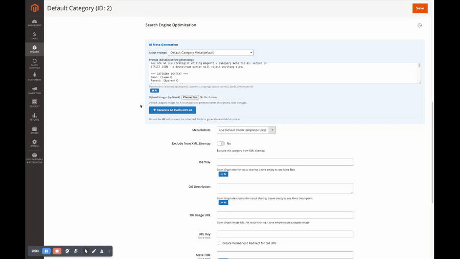
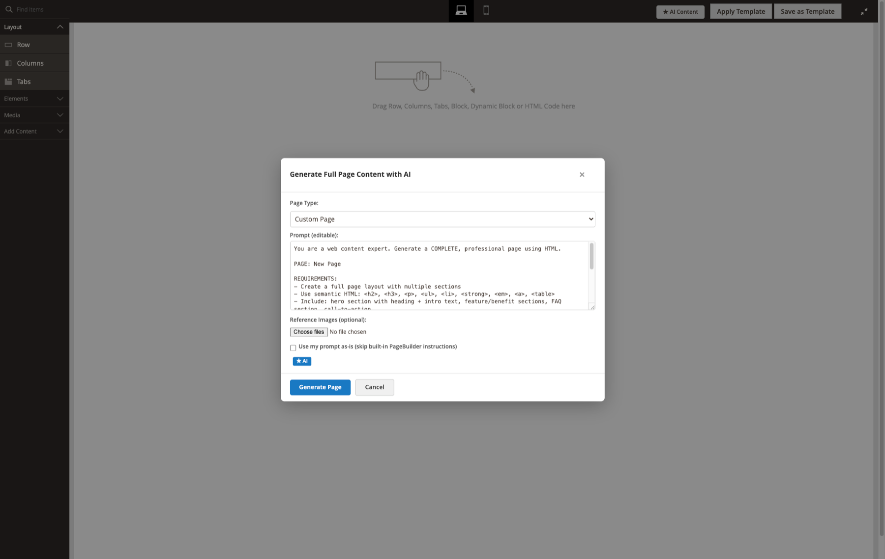
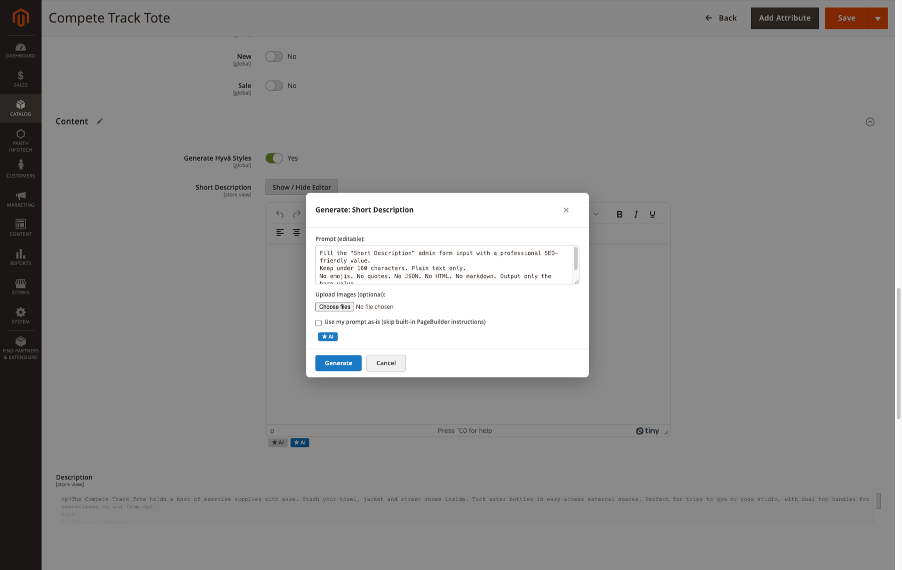
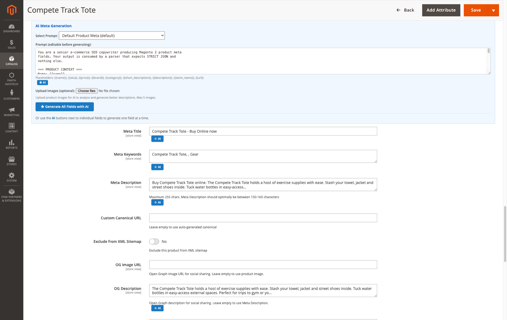
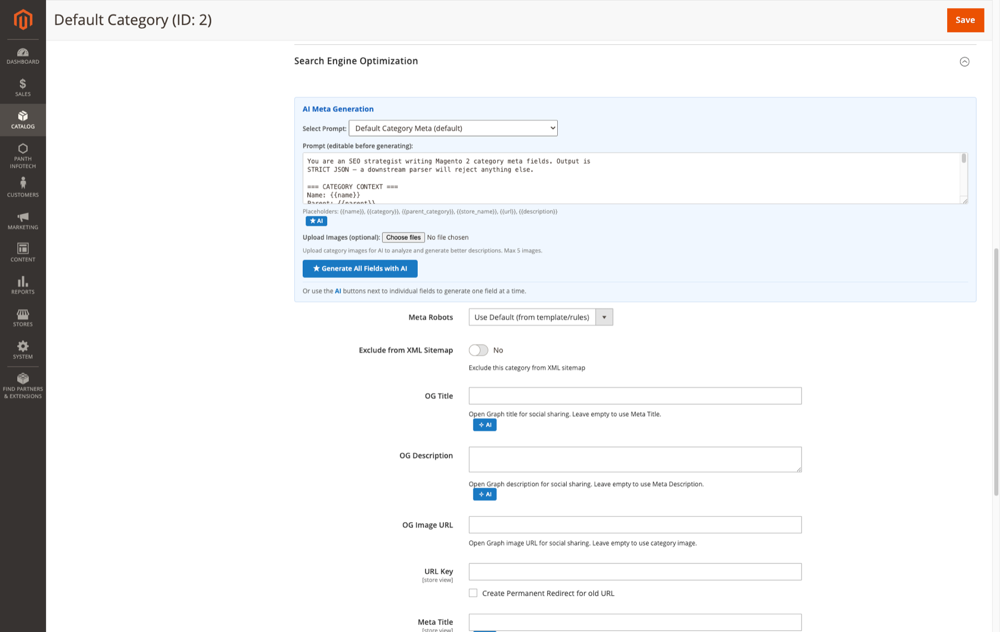
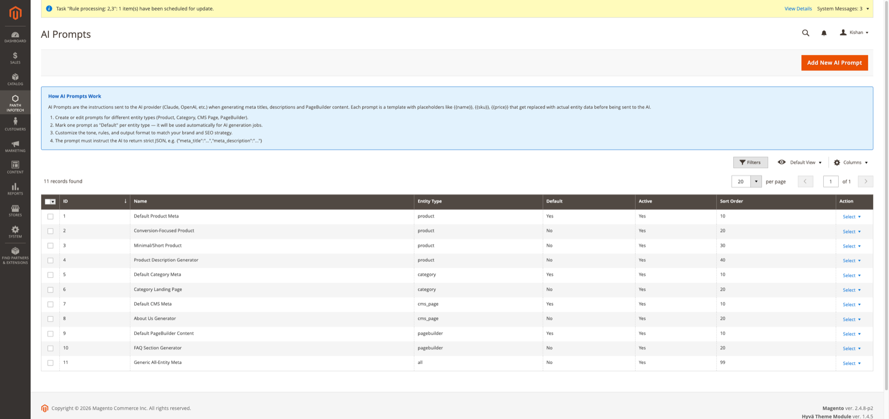
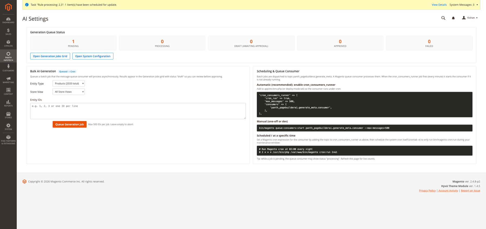
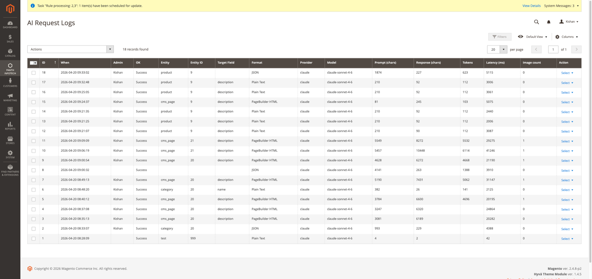
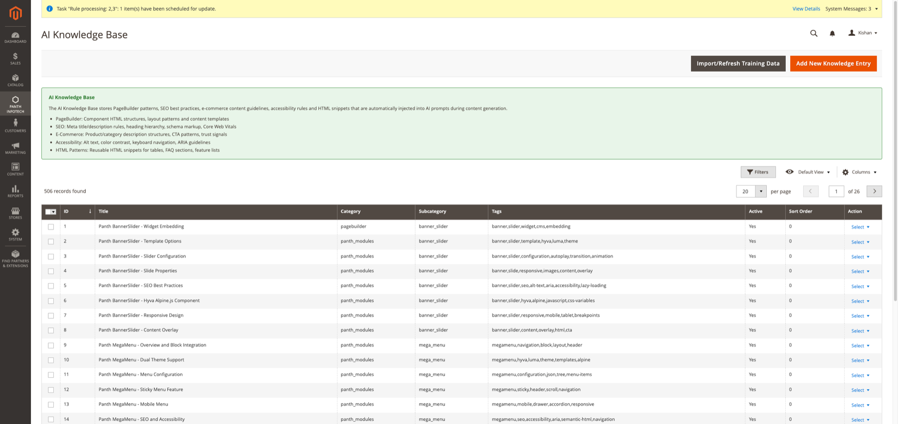
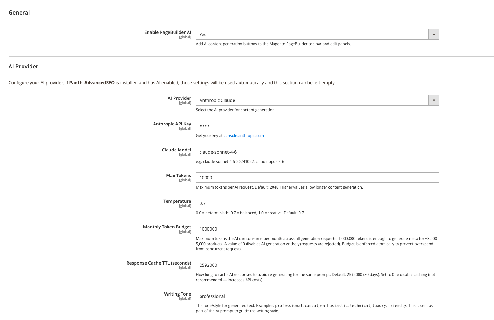

<!-- SEO Meta -->
<!--
  Title: Panth PageBuilder AI - AI Content Generation for Magento 2 PageBuilder | Panth Infotech
  Description: Panth PageBuilder AI adds an AI Content button to the Magento 2 PageBuilder toolbar plus inline AI buttons on every text/textarea field. Generates full-page HTML layouts, section blocks, and field-level copy using OpenAI or Claude — with page-type presets, saved prompt templates, and optional reference-image upload. Compatible with Magento 2.4.4 - 2.4.8 and PHP 8.1 - 8.4.
  Keywords: magento 2 pagebuilder, ai content generation, openai magento, claude magento, ai content for cms, ai pagebuilder, ai-powered ecommerce, magento 2 ai module, gpt magento, anthropic magento
  Author: Kishan Savaliya (Panth Infotech)
  Canonical: https://github.com/mage2sk/module-pagebuilder-ai
-->

# AI Content Generation for Magento PageBuilder

[](https://magento.com)
[](https://php.net)
[](https://openai.com)
[](https://www.anthropic.com)
[](https://packagist.org/packages/mage2kishan/module-pagebuilder-ai)
[](https://www.upwork.com/freelancers/~016dd1767321100e21)
[](https://www.upwork.com/agencies/1881421506131960778/)
[](https://kishansavaliya.com/get-quote)

> **Panth PageBuilder AI** adds an **AI Content** button to the Magento 2 PageBuilder toolbar and inline **AI** buttons to every text/textarea field inside PageBuilder edit panels. It generates full-page HTML layouts, section content, and field-level copy using **OpenAI** or **Anthropic Claude**, with built-in **page-type presets** (Homepage, About, FAQ, Landing, Category, Policy, 404), **saved prompt templates**, and optional **reference-image upload** to guide the layout. Soft-dependency on `Panth_AdvancedSEO` for the AI provider backend.

Write a CMS page or product description in seconds — pick a page type, describe what you want, optionally drop in a reference screenshot, and the module returns a complete PageBuilder-compatible HTML layout ready to save. Field-level buttons let you regenerate a headline, bullet list, or paragraph without leaving the panel.

### Live walkthrough

End-to-end demo on a Category edit screen — open the AI Meta panel, fill in a prompt, generate OG title, meta title, meta description, and URL key in one click.

<p align="center">
  
</p>

<p align="center">
  
</p>

---

## 🚀 Need Custom Magento 2 Development?

> **Get a free quote for your project in 24 hours** — custom AI integrations, PageBuilder extensions, Hyva themes, performance optimization, and Adobe Commerce Cloud.

<p align="center">
  <a href="https://kishansavaliya.com/get-quote">
    
  </a>
</p>

<table>
<tr>
<td width="50%" align="center">

### 🏆 Kishan Savaliya
**Top Rated Plus on Upwork**

[](https://www.upwork.com/freelancers/~016dd1767321100e21)

100% Job Success • 10+ Years Magento Experience
Adobe Certified • AI Integration Specialist

</td>
<td width="50%" align="center">

### 🏢 Panth Infotech Agency
**Magento Development Team**

[](https://www.upwork.com/agencies/1881421506131960778/)

Custom Modules • AI Features • Migrations
Performance • SEO • Adobe Commerce Cloud

</td>
</tr>
</table>

**Visit our website:** [kishansavaliya.com](https://kishansavaliya.com) &nbsp;|&nbsp; **Get a quote:** [kishansavaliya.com/get-quote](https://kishansavaliya.com/get-quote)

---

## Table of Contents

- [Key Features](#key-features)
- [How It Works](#how-it-works)
- [Page-Type Presets](#page-type-presets)
- [Compatibility](#compatibility)
- [Installation](#installation)
- [Configuration](#configuration)
- [Usage](#usage)
- [FAQ](#faq)
- [Support](#support)
- [About Panth Infotech](#about-panth-infotech)
- [Quick Links](#quick-links)

---

## Key Features

### AI Content Button on PageBuilder Toolbar

- **One-click access** — an **AI Content** button lives permanently on the PageBuilder toolbar next to the existing content controls
- **Full-page generation** — generate a complete PageBuilder-compatible HTML layout (rows, columns, headings, text, buttons, images) from a single prompt
- **Page-type presets** — choose from Homepage, About Us, FAQ, Landing, Category Description, Policy, or 404 to pre-load a tuned system prompt
- **Reference-image upload** — optionally attach a screenshot, mockup, or inspiration image; the AI uses it to match layout and tone

### Inline AI Buttons on Edit Panels

- **Every text & textarea field** gets a small **AI** button that appears inside the PageBuilder edit panel
- **Field-aware prompts** — the module passes field context (heading, subheading, CTA text, paragraph) so outputs match the slot
- **Replace or append** — insert the generated text or append it to existing content
- **Regenerate** — not happy with the result? Regenerate with one click, keeping your prompt
- **Raw-prompt mode** — a *"Use my prompt as-is"* checkbox lets you bypass the built-in PageBuilder instructions when you need the LLM to follow your wording verbatim

<p align="center">
  
</p>

### Product, Category & CMS AI Meta Generation

Dedicated SEO panels on product, category, and CMS forms expose an **AI Meta Generation** section with saved-prompt selector, editable prompt box, reference image upload, and per-field AI buttons for Meta Title, Meta Keywords, Meta Description, OG Title, OG Description, and more. Placeholders like `{{name}}`, `{{sku}}`, `{{price}}`, `{{category}}`, `{{description}}` are resolved server-side against live product/category data before the prompt is sent.

<p align="center">
  
</p>

<p align="center">
  
</p>

### Saved Prompt Templates

- **Reusable prompts** — save frequently used prompts (brand voice, tone guides, legal boilerplate) and pick them from a dropdown
- **Per-entity library** — each entity type (product, category, CMS, PageBuilder) maintains its own set of saved prompts
- **Team-friendly** — saved prompts persist across admin users, so your team shares one voice
- **Default prompt per entity** — mark any saved prompt as default for its entity type; it loads automatically when opening the AI panel

<p align="center">
  
</p>

### Bulk Generation & Queue Scheduling

Queue AI generation jobs for up to 500 entities at a time. The module uses Magento's native MessageQueue framework so large batches run asynchronously under `cron_consumers_runner` without blocking the admin. Results land in a *Generation Jobs* grid with draft → approved workflow, so you review AI output before anything touches your live catalog.

<p align="center">
  
</p>

### Request Audit Log

Every prompt and response sent to OpenAI or Claude is persisted in a first-class admin grid — admin user, entity type, entity ID, target field, output format, provider, model, token count, latency, and the full prompt and response text. Ideal for debugging, cost tracking, compliance audits, and showing non-technical stakeholders what the AI is actually producing.

<p align="center">
  
</p>

### AI Knowledge Base

A structured knowledge base of **PageBuilder patterns, SEO rules, e-commerce content guidelines, accessibility guidance, and reusable HTML snippets** gets injected into AI prompts during generation. Ships with 500+ entries covering banner sliders, mega menus, responsive patterns, Core Web Vitals, schema markup, alt text rules, and more. Curate or extend per-brand from the admin.

<p align="center">
  
</p>

### AI Provider Flexibility

- **OpenAI** — GPT-4, GPT-4 Turbo, GPT-4o, GPT-4o mini (configured via `Panth_AdvancedSEO`)
- **Anthropic Claude** — Claude 3.5 Sonnet, Claude 3 Haiku, Claude Opus
- **Bring your own API key** — use your own OpenAI or Anthropic account; no middleman, no per-call markup
- **Swap providers anytime** — change provider in admin and every AI button uses the new backend

### PageBuilder-Native Output

- **Valid PageBuilder markup** — returned HTML uses correct `data-content-type`, `data-element`, and PageBuilder attributes so layouts load cleanly back into the editor
- **Responsive by default** — generated layouts include the standard PageBuilder responsive classes
- **Editable** — every generated block can be edited, duplicated, or deleted like any hand-built PageBuilder content

---

## How It Works

1. **Open** any CMS page, block, product description, or category description that uses PageBuilder
2. **Click AI Content** on the toolbar (or the inline **AI** button on a specific field)
3. **Choose a preset** — Homepage, About, FAQ, Landing, Category, Policy, or 404
4. **Write a prompt** — describe what you want in plain English; optionally attach a reference image
5. **Pick a saved template** (optional) — load a previously saved prompt for your brand voice
6. **Generate** — the module calls your configured AI provider and inserts the result into PageBuilder
7. **Edit, regenerate, or save** — tweak like any other PageBuilder content and save the page

---

## Page-Type Presets

| Preset | What It Generates |
|---|---|
| **Homepage** | Hero + value prop + feature grid + testimonials + CTA sections |
| **About Us** | Story + mission + team + milestones + contact CTA |
| **FAQ** | Question/answer accordion layout with on-brand tone |
| **Landing Page** | Conversion-focused hero + benefits + social proof + form CTA |
| **Category Description** | SEO-friendly category intro with keyword-rich copy |
| **Policy** | Privacy, Terms, Shipping, or Returns policy in clean legal format |
| **404 / Not Found** | Friendly error-page copy with navigation CTAs |

Each preset ships with a tuned system prompt that teaches the AI what PageBuilder markup to produce and what tone to hit. You can override the preset prompt per generation.

---

## Compatibility

| Requirement | Versions Supported |
|---|---|
| Magento Open Source | 2.4.4, 2.4.5, 2.4.6, 2.4.7, 2.4.8 |
| Adobe Commerce | 2.4.4, 2.4.5, 2.4.6, 2.4.7, 2.4.8 |
| Adobe Commerce Cloud | 2.4.4 — 2.4.8 |
| PHP | 8.1.x, 8.2.x, 8.3.x, 8.4.x |
| Magento PageBuilder | 2.2+ (bundled with 2.4.4+) |
| Panth Core | 1.0+ (required) |
| Panth Advanced SEO | 1.0+ (soft dependency — provides AI backend) |
| OpenAI API | GPT-4, GPT-4 Turbo, GPT-4o family |
| Anthropic API | Claude 3 Haiku, Claude 3.5 Sonnet, Claude Opus |

---

## Installation

### Composer Installation (Recommended)

```bash
composer require mage2kishan/module-pagebuilder-ai
bin/magento module:enable Panth_Core Panth_PageBuilderAi
bin/magento setup:upgrade
bin/magento setup:di:compile
bin/magento setup:static-content:deploy -f
bin/magento cache:flush
```

### Manual Installation via ZIP

1. Download the latest release ZIP from [Packagist](https://packagist.org/packages/mage2kishan/module-pagebuilder-ai) or the [Adobe Commerce Marketplace](https://commercemarketplace.adobe.com)
2. Extract the contents to `app/code/Panth/PageBuilderAi/`
3. Run the same commands as above

### Verify Installation

```bash
bin/magento module:status Panth_PageBuilderAi
# Expected output: Module is enabled
```

Open any CMS page — you should see an **AI Content** button on the PageBuilder toolbar.

---

## Configuration

Navigate to `Admin → Stores → Configuration → Panth Extensions → PageBuilder AI`:

<p align="center">
  
</p>

| Setting | Default | Description |
|---|---|---|
| Enable PageBuilder AI | Yes | Master toggle for the AI Content button and every inline AI button |
| AI Provider | Anthropic Claude | Anthropic Claude or OpenAI — swap anytime |
| OpenAI / Anthropic API Key | — | Your own API key; no Panth-hosted middleman |
| Model | claude-sonnet-4-6 | e.g. `claude-sonnet-4-5-20241022`, `claude-opus-4-6`, `gpt-4o`, `gpt-4o-mini` |
| Max Tokens | 8192 | Ceiling on tokens per AI request; higher values allow longer content |
| Temperature | 0.7 | `0.0` = deterministic, `0.7` = balanced, `1.0` = creative |
| Monthly Token Budget | 1 000 000 | Hard cap on tokens consumed per month across all requests; atomically enforced to prevent concurrent overspend |
| Response Cache TTL | 2 592 000 (30 days) | Seconds to cache identical prompt→response pairs; set `0` to disable |
| Writing Tone | professional | e.g. `professional`, `casual`, `enthusiastic`, `technical`, `luxury`, `friendly` |

If `Panth_AdvancedSEO` is installed and already has an AI provider configured, PageBuilder AI reuses those credentials automatically and the fields above can be left empty.

---

## Usage

### Full-Page Generation

1. Open a CMS page in `Admin → Content → Pages → Add New Page` (or edit an existing one)
2. Switch the content area to PageBuilder
3. Click **AI Content** in the toolbar
4. Choose a page-type preset (e.g., Homepage)
5. Write a prompt like: *"Modern SaaS homepage for a project management tool. Hero with screenshot, 3-column feature grid, customer logos, pricing CTA."*
6. (Optional) Upload a reference screenshot of a layout you like
7. (Optional) Select a saved prompt template
8. Click **Generate** — PageBuilder loads the generated layout

### Field-Level Generation

1. Click any PageBuilder block (Heading, Text, Buttons, etc.)
2. In the edit panel, click the small **AI** button next to a text or textarea field
3. Describe what you want (e.g., *"Punchy 6-word headline about free shipping"*)
4. Click **Generate** — the field is filled with the result
5. Click **Regenerate** if you want another variation

### Saving Prompt Templates

1. In the AI Content modal, click **Save this prompt**
2. Give it a name (e.g., *"Brand voice — friendly techy"*)
3. The template appears in the dropdown on all future generations

---

## FAQ

### Do I need Panth_AdvancedSEO for this to work?

Yes, as a soft dependency. PageBuilder AI uses the AI provider backend (API key storage, request handling, rate limiting) from `Panth_AdvancedSEO`. If Advanced SEO is not installed, the AI buttons render but show an installation prompt instead of generating.

### Which AI providers are supported?

**OpenAI** (GPT-4, GPT-4 Turbo, GPT-4o, GPT-4o mini) and **Anthropic Claude** (Claude 3 Haiku, Claude 3.5 Sonnet, Claude Opus). You configure your own API key in admin — there is no Panth-hosted middleman.

### Do I pay Panth for each generation?

No. You pay your chosen provider (OpenAI or Anthropic) directly for API usage. Panth PageBuilder AI is a one-time-license extension — no per-generation fees, no markup.

### Does it work with Hyva themes?

Yes. This module is admin-only and does not emit any frontend output, so it works identically regardless of whether your storefront is Hyva or Luma.

### Will generated content be SEO-friendly?

Yes. The page-type presets include SEO instructions in their system prompts (keyword-rich headings, semantic HTML, meta-friendly copy). Pair with `Panth_AdvancedSEO` for full meta-tag generation.

### Can I use it on product and category descriptions?

Yes. Any content field in Magento that uses PageBuilder (CMS Pages, CMS Blocks, Product Description, Category Description, Email Templates) gets the AI Content button automatically.

### Is the output actually valid PageBuilder markup?

Yes. The system prompts explicitly instruct the AI to produce Magento PageBuilder markup with correct `data-content-type` and `data-element` attributes. Generated layouts load cleanly back into the editor for further editing.

### Can I upload a reference image?

Yes, when your chosen model supports vision (GPT-4o, GPT-4 Turbo, Claude 3.5 Sonnet, Claude Opus). Upload a screenshot or mockup and the AI uses it to match layout and visual tone.

### Does it store my prompts?

Saved prompt templates are stored in your Magento database. Transient prompts and generated outputs are not logged unless you enable Debug Mode.

### Is multi-store supported?

Yes. All settings respect Magento's standard scope hierarchy (default → website → store view).

---

## Support

| Channel | Contact |
|---|---|
| Email | kishansavaliyakb@gmail.com |
| Website | [kishansavaliya.com](https://kishansavaliya.com) |
| WhatsApp | +91 84012 70422 |
| GitHub Issues | [github.com/mage2sk/module-pagebuilder-ai/issues](https://github.com/mage2sk/module-pagebuilder-ai/issues) |
| Upwork (Top Rated Plus) | [Hire Kishan Savaliya](https://www.upwork.com/freelancers/~016dd1767321100e21) |
| Upwork Agency | [Panth Infotech](https://www.upwork.com/agencies/1881421506131960778/) |

Response time: 1-2 business days.

### 💼 Need Custom Magento Development?

Looking for **custom AI integrations**, **PageBuilder extensions**, **Hyva theme customization**, or **performance optimization**? Get a free quote in 24 hours:

<p align="center">
  <a href="https://kishansavaliya.com/get-quote">
    
  </a>
</p>

<p align="center">
  <a href="https://www.upwork.com/freelancers/~016dd1767321100e21">
    
  </a>
  &nbsp;&nbsp;
  <a href="https://www.upwork.com/agencies/1881421506131960778/">
    
  </a>
  &nbsp;&nbsp;
  <a href="https://kishansavaliya.com">
    
  </a>
</p>

---

## About Panth Infotech

Built and maintained by **Kishan Savaliya** — [kishansavaliya.com](https://kishansavaliya.com) — a **Top Rated Plus** Magento developer on Upwork with 10+ years of eCommerce experience and deep expertise in AI integration for Magento 2.

**Panth Infotech** is a Magento 2 development agency specializing in high-quality, security-focused extensions and themes for both Hyva and Luma storefronts. Our extension suite covers SEO, performance, checkout, product presentation, AI-powered content, customer engagement, and store management — over 34 modules built to MEQP standards and tested across Magento 2.4.4 to 2.4.8.

Browse the full extension catalog on the [Adobe Commerce Marketplace](https://commercemarketplace.adobe.com) or [Packagist](https://packagist.org/packages/mage2kishan/).

---

## Quick Links

- 🌐 **Website:** [kishansavaliya.com](https://kishansavaliya.com)
- 💬 **Get a Quote:** [kishansavaliya.com/get-quote](https://kishansavaliya.com/get-quote)
- 👨‍💻 **Upwork Profile (Top Rated Plus):** [upwork.com/freelancers/~016dd1767321100e21](https://www.upwork.com/freelancers/~016dd1767321100e21)
- 🏢 **Upwork Agency:** [upwork.com/agencies/1881421506131960778](https://www.upwork.com/agencies/1881421506131960778/)
- 📦 **Packagist:** [packagist.org/packages/mage2kishan/module-pagebuilder-ai](https://packagist.org/packages/mage2kishan/module-pagebuilder-ai)
- 🐙 **GitHub:** [github.com/mage2sk/module-pagebuilder-ai](https://github.com/mage2sk/module-pagebuilder-ai)
- 🛒 **Adobe Marketplace:** [commercemarketplace.adobe.com](https://commercemarketplace.adobe.com)
- 📧 **Email:** kishansavaliyakb@gmail.com
- 📱 **WhatsApp:** +91 84012 70422

---

<p align="center">
  <strong>Ready to ship AI-powered content on your Magento 2 store?</strong><br/>
  <a href="https://kishansavaliya.com/get-quote">
    
  </a>
</p>

---

**SEO Keywords:** magento 2 pagebuilder, ai content generation, openai magento, claude magento, ai content for cms, ai pagebuilder, ai-powered ecommerce, magento 2 ai module, chatgpt magento, anthropic magento, gpt-4 magento, magento pagebuilder extension, magento cms ai, magento 2 content generator, ai copywriting magento, magento 2.4.8 ai, magento hyva ai, panth pagebuilder ai, panth infotech, kishan savaliya, top rated plus magento, hire magento developer, mage2kishan, mage2sk, magento marketplace developer, magento 2 custom development, ai seo magento, generative ai ecommerce, magento landing page ai, magento homepage generator, magento faq generator, magento category description ai, magento product description ai, reference image ai layout, saved prompt templates magento
